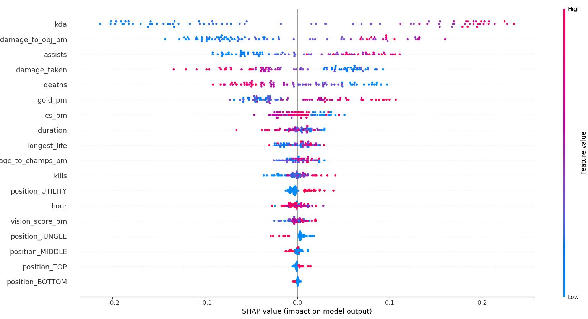
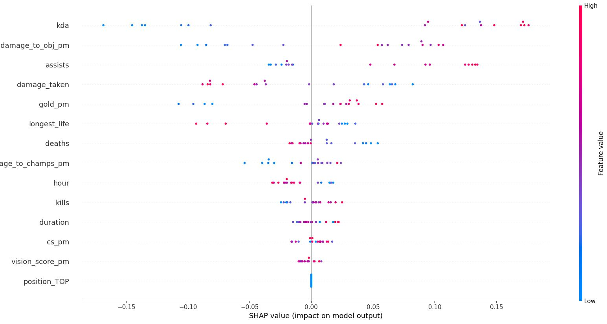

# League-of-Legends-Win-Predictor
## Instructions
1. Create a file titled `config.py` and enter your summoner name as the `USERNAME` and your Riot API key as `API_KEY` like so:
```
API_KEY = "RGAPI-xxxxxxxx-xxxx-xxxx-xxxx-xxxxxxxxxxxx"
USERNAME = "dragonsp"
```
2. Run `main.py` to retrieve all the matches available in Riot's database and import relevant data to GCP via BigQuery
3. If more matches have been played, run the `update_match.py` file to retrieve them and add the data to the database
4. Run `load.py` to clean the data and prepare for analysis

## Variables retrieved from the Riot API
* Game ID
* Start time
* Duration
* Queue
  * 400 - 5v5 Summoner's Rift Draft Pick
  * 420 - Solo/Duo
  * 430 - 5v5 Blind Pick
  * 440 - Flex
  * 450 - ARAM
  * 700 - Clash
  * Other custom game modes...
* Match result
* Champion Name
* Role/Lane
* Kills
* Deaths
* Assists
* Damage dealt to champions
* Damage dealt to objectives 
* Damage taken
* Gold
* CS
* Vision score
* Longest life
* Potentially to add:
  * Team data - first blood, first tower, first inhib, first baron, first dragon, number of dragons etc.

## Analysis and Insights
Filters:
* Date
* Queue
* ChampID
* Match result
* Match duration
* Role/Lane (Position)

## Predictive Model
Note: League of Legends is a team based game and these models only examine individual performance. I want to see how much 1 person can influence a game. That being said, many of the features analyzed are dependent on teammates (e.g. one likely does not get more kills if the team is fails to support). 
### Predicting the outcome of a match using your performance in the match
#### Motivation
This looks to determine which factors of your performance (e.g. KDA, cs/min, vision score etc.) have the largest effect on the outcome of a match. Often times, I struggle with identifying which areas of my play need improvement and may have cost us the game. One component in particular - creep score (or cs) - is one that I have a large control over and I'm very curious to know how much that really affects the game. The challenge is that many of these variables may be dependent on each other. For example, I may miss some creeps because I moved to get some kills, but I may also miss creeps because I mistimed the last hit. The former can be argued as worth or not, but the latter is definitely a detriment. 

#### Results
Using cross-validation, this model has a roughly 81% accuracy. The SHAP values of the various features for different matches were analyzed. 
<br>



In short, the magnitude of a SHAP value indicates the size of effect that feature had on the predicted outcome of the model. The sign of the SHAP shows whether the effect was positive or negative. 
The plot above shows the SHAP values of various features for many matches analyzed. The colour indicates the magnitude of the feature itself (not the effect) where red symbolizes larger values and blue smaller. 
From the visualization, it can be seen that KDA has the largest effect both negatively and positively. Note that this was based on all matches where all 5 different roles have been played (at varying amounts). The SHAP values may vary depending on role. The same plot is generated using only games where I played "TOP" (my main role).
<br>



In this plot, most of the general patterns are the same, but there are a few noticeable differences. For instance, the negative effect of a low assist game is much less while the positive effect remains large. This implies that it is not too detrimental if I lack assists, but it is greatly beneficial if I have a lot. Considering this in context, the TOP role is known to be very isolated in nature and often far from the action. A TOP laner usually joins through the use of "teleport". This suggests that I should try to look for more opportunities to use this and assist the team. 

Another interesting point is that vision score and cs, two features that the individual has large control over (mostly based on timing, game knowledge, habits etc.), have a relatively small effect on the outcome of the game. There's a common saying that "vision wins games" but it seems that isn't the case for me. 

### Predicting the outcome of a match using your performance in the **previous** match
#### Motivation
Similar to the "[hot hand](https://www.sciencedirect.com/science/article/abs/pii/0010028585900106)" theory in basketball, this investigates the idea of having a "good" day where you are playing well. Personally, I have days where I feel more focused and on top of my game or "in the groove". Moreso, I have days where I feel "out of it" often attributed to factors like physical sickness or fatigue. Another phenomenon I experience is related to overestimating/underestimating my abilities. If I just played well, I would sometimes try to make plays that I shouldn't which negatively affect the chances of winning.  I want to explore if any of these phenomena are observable from the data (e.g. I often lose after a good game). However, as mentioned earlier, this is a team game and that is something you do not have much control over. This project assumes that matchmaking is perfect, but there are 9 other players that each have a large role in the outcome of the match. 

#### WIP